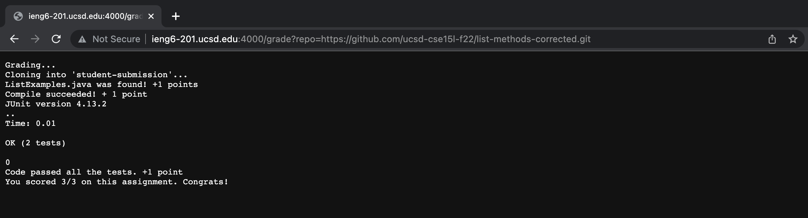
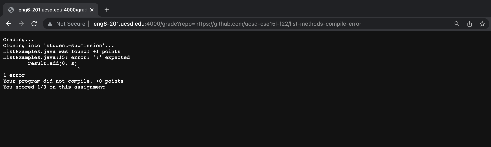
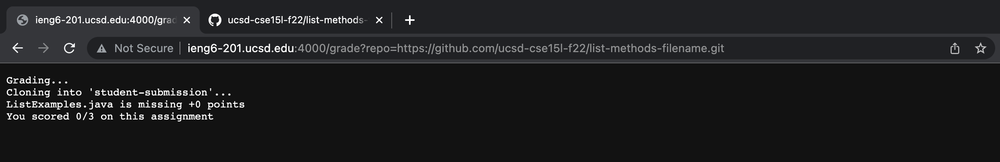

# Lab Report 5
## Grade.sh File
```
echo 'Grading...'
CPATH='.:../lib/hamcrest-core-1.3.jar:../lib/junit-4.13.2.jar'
rm -rf student-submission
git clone $1 student-submission
cd student-submission
if [[ -e ListExamples.java ]]
then
    echo 'ListExamples.java was found! +1 points'
else
    echo 'ListExamples.java is missing +0 points'
    echo 'You scored 0/3 on this assignment'
    exit 1
fi
cd ..
cp TestListExamples.java ./student-submission
cd student-submission
javac -cp $CPATH *.java 2> output-error.txt
if [[ ! -s output-error.txt ]]
then
        echo 'Compile succeeded! + 1 point'
else
        cat output-error.txt
        echo 'Your program did not compile. +0 points'
        echo 'You scored 1/3 on this assignment'
        exit 1
fi
java -cp $CPATH org.junit.runner.JUnitCore TestListExamples
java -cp $CPATH org.junit.runner.JUnitCore TestListExamples > testOutput.txt
echo $?
if grep -Fxq "FAIL" testOutput.txt
then
    echo 'Code failed the tests. +0 points'
    echo 'You scored 2/3 on this assignment'
    exit 1
else
    echo 'Code passed all the tests. +1 point'
fi
echo 'You scored 3/3 on this assignment. Congrats!'
exit 0
```
## Submission 1
Repository used: https://github.com/ucsd-cse15l-f22/list-methods-corrected

## Submission 2
Repository used: https://github.com/ucsd-cse15l-f22/list-methods-compile-error

## Submission 3
Repository used: https://github.com/ucsd-cse15l-f22/list-methods-filename

## Trace of Submission 2
 - echo 'Grading...'
     - stdout: Grading...
     - stderr: none
     - return code: 0
 - rm -rf student submission
     - stdout: none
     - stderr: none
     - return code: 0 
 - git clone $1 student-submission
     - stdout: Cloning into 'student-submission'...
     - stderr: 0
     - return code: 0
 - cd student-submission
     - stdout: none
     - stderr: none
     - return code: 0
 - if [[ -e ListExamples.java ]]
     - condition returns true because ListExamples.java exists in the student submission and compiles
 - echo 'ListExamples.java was found! +1 points'
     - stdout: ListExamples.java was found! +1 points
     - stderr: none
     - return code: 0
 - cd ..
     - stdout: none
     - stderr: none
     - return code: 0 
 - cp TestListExamples.java ./student-submission
     - stdout: none
     - stderr: none
     - return code: 0 
 - cd student-submission
     - stdout: none
     - stderr: none
     - return code: 0 
 - javac -cp $CPATH *.java 2> output-error.txt
     - stdout: none
     - stderr: 
        ListExamples.java:15: error: ';' expected
        result.add(0, s)
                        ^
        1 error
     - return code: 1
 - if [[ ! -s output-error.txt ]]
     - condition returns false because output-error.txt is a file with a size greater tha zero
 - cat output-error.txt
     - stdout: 
       ListExamples.java:15: error: ';' expected
        result.add(0, s)
                        ^
        1 error
     - stderr: none
     - return code: 0
 - echo 'Your program did not compile. +0 points'
     - stdout: Your program did not compile. +0 points
     - stderr: none
     - return code: 0
 - echo 'You scored 1/3 on this assignment'
     - stdout: You scored 1/3 on this assignment
     - stderr: none
     - return code: 0
 - exit 1
     - stdout: none
     - stderr: none
     - return code: 0
 
 ***All lines after this point do not run due to early exit. The commands that do not run are:***
 
- java -cp $CPATH org.junit.runner.JUnitCore TestListExamples
- java -cp $CPATH org.junit.runner.JUnitCore TestListExamples > testOutput.txt
- echo $?
- if grep -Fxq "FAIL" testOutput.txt
- echo 'Code failed the tests. +0 points'
- echo 'You scored 2/3 on this assignment'
- exit 1
- echo 'Code passed all the tests. +1 point'
- echo 'You scored 3/3 on this assignment. Congrats!'
- exit 0

